# **CAC data automation**
## **Site Overview**
CAC data automation is a python terminal interface running on a Code Institute mock terminal on Heroku.
It is designed for CAC allergy clinicians to add new patients to a Google Sheet worksheet and to report sheet-wide data back to the user.

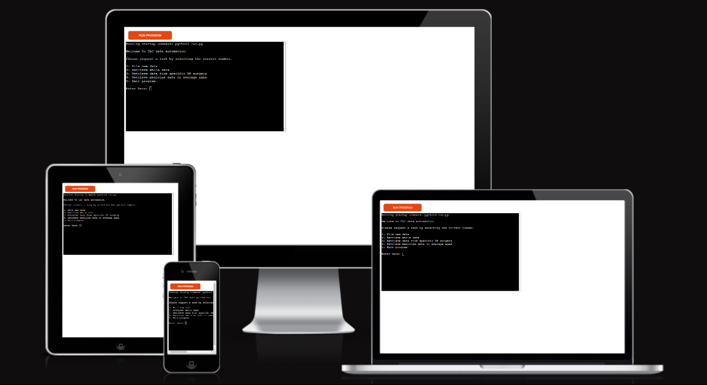

[A live version of this site can be found here.](https://cac-datasheet.herokuapp.com/)

[A read only version of the CAC spreadsheet, which is fully annomynised, can be found here.](https://docs.google.com/spreadsheets/d/1nFmgz1iyO5o0y2OWM9ewPciJonE4esd9HCYufjX7swQ/edit#gid=0)

## Table of contents:
1. [**Site Overview**](#site-overview)
1. [**Planning stage**](#planning-stage)
    * [***Target Audiences***](#target-audiences)
    * [***User Stories***](#user-stories)
    * [***Site Aims***](#site-aims)
1. [**Features**](#features)
    * [***Menu***](#menu)
    * [***Get Patient Data***](#get-patient-data)
    * [***Get Date***](#get-date)
    * [***Get GP Surgery***](#get-gp-surgery)
    * [***Get Referrer***](#get-referrer)
    * [***Get Input Device***](#get-input-device)
    * [***Get GP Surgery***](#get-gp-surgery)
    * [***Get Outcome***](#get-outcome)
    * [***Get Alternative Diagnosis***](#get-alternative-diagnosis)
    * [***Get Medicine***](#get-medicine)
    * [***Get Outcome***](#get-outcome)
    * [***Get Test***](#get-test)
    * [***Get Referral Reason***](#get-referral-reason)
    * [***Get Note***](#get-note)
    * [***Upload Patient Data***](#upload-patient-data)
    * [***Get Numbers***](#get-numbers)
    * [***Get Specific Numbers***](#get-specific-numbers)
    * [***Get Average Age***](#get-average-age)
    * [***Close Program***](#close-program)
1. [**Future Enhancements**](#future-enhancements)
    * [***Relational Data***](#relational-data)
    * [***Human error***](#human-error)
1. [**Flow Chart**](#flow-chart)
1. [**Testing Phase**](#testing-phase)
    * [***Responsiveness***](#responsiveness)
    * [***Functionality***](#functionality)
    * [***Verification***](#verification)
1. [**Bugs**](#bugs)
    * [***Calling the main menu twice***](#calling-the-main-menu-twice)
    * [***Unresolved Bugs***](#unresolved-bugs)
1. [**Deployment**](#deployment)
    * [***Steps for deployment***](#steps-for-deployment)
1. [**Credits**](#credits)
    * [**Code**](#code)
    * [**Project**](#project)
​
## **Planning stage**
### **Target Audiences:**
* CAC Clinicians
​
### **User Stories:**
* As a user, I want to update my patients to the CAC worksheet efficiently.
* As a user, I want to be get a quick summary of the entire CAC worksheet easily.
* As a user, I want to get complete data from specific GP surgeries.
​
### **Site Aims:**
* To standardise what data can be inputed into specific cells of the CAC worksheet, and to standardise the process of appending new patients.
* To automise the process of collecting data from a Google Sheets worksheet in a way that is easy to learn and execute.
​​
## **Features**

### *Menu*
* At this point, the terminal prints a list of numbered options.
* Should the user enter one of these numbers, the action specified in the list will begin to be carried out. 

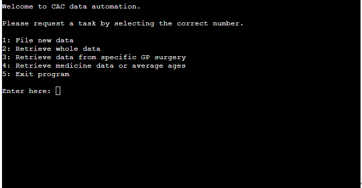

* Should the user enter a number that is not in the list, or enter a value that is not a number, the terminal shall raise an error and request the user to try again.

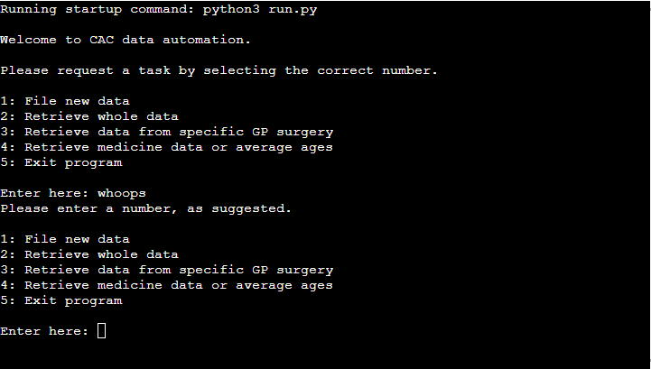

### *Get Patient Data*
* This function calls a number of functions, each of which requests the user to enter dates, names of GP surgeries, or a selection from a range of choices.
* Every time a function in this list is complete, it is appended to an array later to be appended as a row to the data sheet.

### *Get Date*
* At this point, the user will be prompted to enter a date in the MM/DD/YYYY format, since this was the format being used by the clinicians before this project's inception.
* This function is used to collect a patient's date of birth, and the date of their referral.

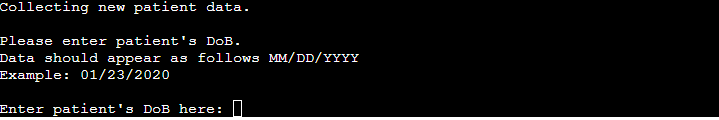

* If the user input does not match the MM/DD/YYYY format, it will be rejected and the request for a date will be prompted again.

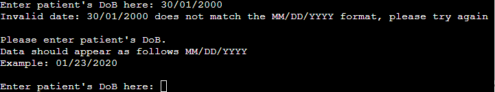

### *Get GP Surgery*
* At this point, the terminal will request the name of the referring surgery.
* The string value that the user enters will have the .title() function applied to it before being appended to the data array.

### *Get Referrer*
* The terminal will request the initials of the referring person.
* The string value that the user enters will have the .upper() function applied to it before being appended to the data array.

### *Get Input Device*
* The terminal will request the input device of the patient both before and after the review of the patient.
* The terminal will print a list of options, based on whether they are referring to the device before or after the reivew.
* The user will input their response in the same manner as the main menu's selection process.
* The input verification process is identical to that of the main menu's and will hereby be referred to as the 'standard verification process'.
* When getting the device "before" the patient's review, there will also be an 'Other' option, since the number of possible devices is too large to fit onto a terminal.
* Should the user enter 'Other', they will be prompted to enter the name of the device.

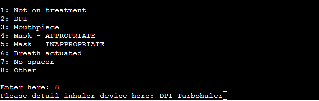

### *Get Outcome*
* The terminal will request the outcome of the referral.
* The terminal will print a list of options, and will verify the user's input via the standard verification process.

### *Get Alternative Diagnosis*
* If the patient outcome previously selected was "Alternative Diagnosis", then the user will be prompted to detail the alternative diagnosis, which will be appended to the data array.
* If the patient outcome was not "Alternative Diagnosis", however, the appended value will simply be a blank string.

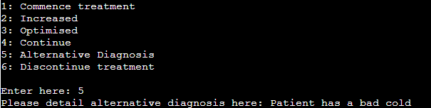

### *Get Medicine*
* The terminal will request the medicine prescribed after review.
* The terminal will print a list of options, and will verify the user's input via the standard verification process.
* Once a drug has been selected, the prescription doses of the selected drug will be printed, which the user then selects. The input is once again, sent through the verification process.

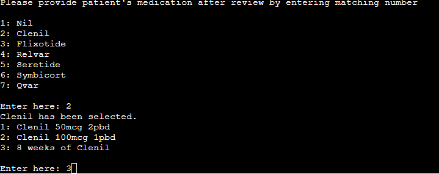

### *Get Test*
* The terminal will inquire whether any allergy testing had been performed.
* The terminal will print a list of options, and will verify the user's input via the standard verification process.

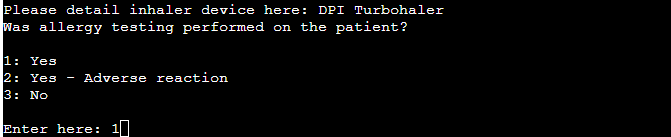

### *Get Referral Reason*
* The terminal will request for the reason for the patient's referral.
* The terminal will print a list of options, and will verify the user's input via the standard verification process.

### *Get Note*
* The terminal will request whether the user wants to add any notes, and will be prompted to respond 'y' for yes and 'n' for no.
* The terminal will ensure that the user enters either 'y' or 'n' only and will raise an error if this is not the case.
* If the response is 'y', it will allow the user to enter a string value of any size. If the respone is 'n', it will return a blank string to the data array.

### *Upload Patient Data*
* When all the data is collected, it is appended to the CAC google sheet.
* The user will then have to enter any string, even an empty one, to return back to the main menu.

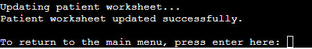

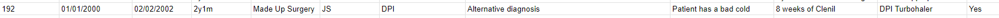

### *Get Numbers*
* This function allows for the user to specify how many instances of values inside a particular column are present. 
* I.E. The number of inhalation devices used, or the medications prescribed.

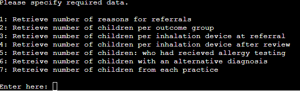

* After a type of data is specified, it is printed to the terminal.

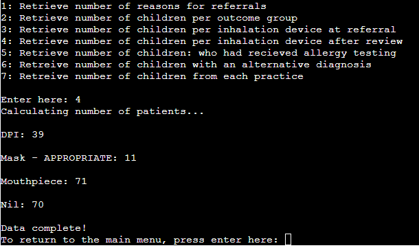

* It will then print Data complete, and prompt the user to return to the main menu.

### *Get Specific numbers*
* This function performs the same as the function above, but is more specific in that it only prints values that match a patient referral reason or a GP surgery specified by the user.

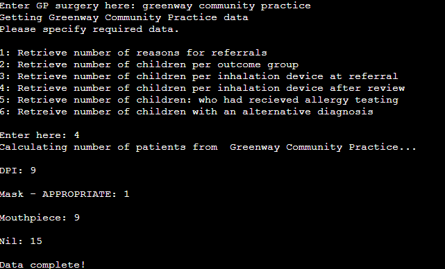

* To verify the specified GP practice, the string value inputed by the user is put through the .title() function. If it does not match one of the preexisting GPs, then the value is not accepted, and the user is prompted to ensure proper spelling.

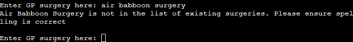

* If the specified surgery has none of the requested data, the terminal simply prints that there is no data of this type.

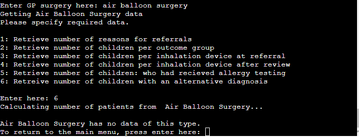

### *Get Average Age*
* This function calculates the average age of the entire patient worksheet, or of patients referred for either 'Poor contol' or 'Diagnostic testing'.

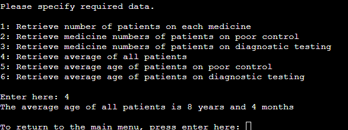

### *Close Program*
* If the user enters option 5 in the main menu, the terminal will print "Goodbye" (because manners are important) and close itself.

## **Future-Enhancements**

### *Relational Data*
* Two things that felt clunky about this project was the variety of prescribable medication; and being able to request data from a specific GP practice.
* A way to make this more elegant would be to create a dictionary of medication, and to save all patient data in a dictionary so that one could aquire the correct data types by specifying a particular key or value. 
* Additionally, if CAC decided to prescribe new drugs or new dosages of drugs, the entire code would have to be rewritten. A more reliable way would have been to create a loop for every drug in a drug list. 

### *Human error*
* Having gone through this worksheet, I had found a number of spelling mistakes in the GP surgery column. This caused the different spelling of the same surgery to be printed when called.
* A way to improve this would be to use the GP surgeries' code. LC126 for Horfield Health Centre for example.

## **Imports and Inspiration**
### *dateutil*
* In order to be able to calculate the age of a patient on the date of their referral, I had to import and use python-dateutil to calculate the difference between two dates.

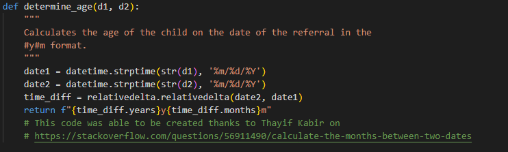

### *numpy*
* In lieu of having relational data, I had to use a numpy import in order to determine the indices of specified GP practices within the GP surgery column so that I could print the data from specific surgeries.

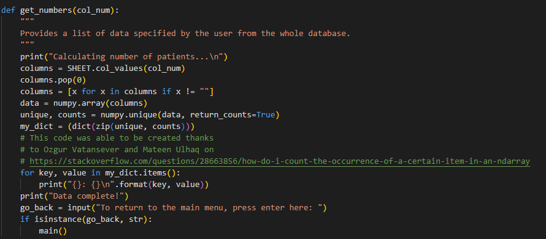

## **Flow Chart**
[A link to an image of the flow chart illustrating how CAC data automation works.](https://viewer.diagrams.net/?tags=%7B%7D&highlight=0000ff&edit=_blank&layers=1&nav=1&title=CAC_flow_chart.drawio#R7X1Zd%2BM2tu5v6QevuB6shYHg8FhTunNvp7pOUre78%2BTFkmmbN7KkaEiV8%2BsPJ1AiNihCIgGQFLO6E1sWIYrAt%2Bf97Rv6%2FuX73zfh%2Bvnn1UO0uCHo4fsN%2FXBDCCXYS%2F6TvvKav0IYcvNXnjbxQ%2F4aPrzwa%2FxXVLyIilf38UO0rbxxt1otdvG6%2BuJ8tVxG813ltXCzWX2rvu1xtah%2B6jp8isALv87DBXz1P%2FHD7jl%2F1Sfe4fV%2FRPHTM%2F9k7Ab5X15C%2Fubim2yfw4fVt6OX6Mcb%2Bn6zWu3yn16%2Bv48W6dPjz%2BU%2FP73%2BZ%2FHP392%2F%2F5%2F%2F2f4R%2Fr93%2F%2FfLp3%2Ff5Yv9eM4l5VfYRMvdxUt%2F%2FeU%2FbBn896%2Fvn%2F%2F87%2Bv7R%2Bft64f%2FKS5Bf4aLffG8ft2Fm13xhXev%2FCkmSyUblvzy7ttzvIt%2BXYfz9C%2FfkkOTvPa8e1kkv%2BHkx8d4sXi%2FWqw22XU0YthBKH19tdwdvf6Y%2FZO8vt1tVr9HR395RxDKrijuLNrsou%2FCVjY8B1xuTnKso9VLtNu8JtfxVWjxpYsTfUf84oVvh%2FOB%2BaY%2FH50N%2Fr6wOJJP5dqHx578UDz5M3aBgF2AG7B8eJuiIfltvgi323hefe6b1X75EKUfcnh20QOAhsqTSwAabp6i3YkbpvInfPQAmeT58dc20SLcxX9W7032UItP%2BLyKk7s%2BbGAgbiASNma72m%2FmUXHZMSSaViq3na%2BUPwmwUrbL5Re%2FfOMp8%2BFOJ7v2a%2FHrarN7Xj2tluHi4%2BFVYa8P7%2FnnarUujsP%2Fj3a710IYh%2FvdqnpYkkOwef1vev2M8V9%2FK5bLfvnwvfLbazfHKt%2BWpmOlcvyYJz%2BAyierFVwpgOt6kxyQ2xvi%2FrFPtcG7z4soTKRlekN%2F7KNteuTCm%2FRsuYv0z183yU9P6U%2B7cPt78oev6c0nzzBK1nlK%2Fha%2BpGJ1%2BXW7zp46uOo5yjTmZpNqTIKW%2B5ev0WZ2%2BPw34FQlymud%2FpjsVbhYRIvV0yZ8Sd65Tj4yeSrRRvzb58MfmmX%2B94hrfokOePTn0Xwuk%2FVffeYwrbIeiwD3JLLeNSnrnV7Jemsy3A9mjlPZG%2B9SIQ6XSmwOo2LcV9hT%2FVJdt3RmitLZqmxmYCvix1xCpvI3eSF9DWGwP5vn1cvX%2FfZsA%2FeBRf6DIxNuPvlKXVencGNV4Vae%2BiMI%2ByZFmwue%2FY%2FhIlWDVyjfBMuSiIblpSYq2D3dFiqmY5RlnqIsC2zKMk9JlkFdMwJZ5mPLsixQevYQGyN49pj4xO7D55vfJ02iICxwjeVjR%2BVg6pJudA52iLCSZqWD1SSfMxL0zQirPm%2BfWpZ%2BGHo01gFoEVdggwJ8uTkHFxM9X83oYpaCjt%2Fj3X%2BLy9Ofs4BjHn9MfjtEHNNfeMCxDFSWUcujqywGKrk136gSmN1IJWPQjqkBcvKs%2Fhl%2BjRbVTQsX8dMyBXcWnExeSAVgPA8Xb4s%2FvMQPD%2Fn5iLbxX%2BHXbL10C9bp8c2%2BD3t3wz6ckqBF6q%2B4%2BKb0lY6369RJrpWtd2iGvcCtwI3v8aVSgb9l9fi4jbTgk0DrR6b92Fi1XyCJ0RrVftzaOdqAL5v9VSo%2FIiRLEziVwdZzdR%2FFzWtpVn0Epm462NlSSyXyBiFHUFUBbVBW2W9H6RYzGVzs9Olc%2BU5350q2lu5zBbM6k8QoFqAEdycyZIvp3luYUpj2tljAd4MZ81H5z4UBB7DNDevq3nGYyOhSS5gtumjUBKRXUavErkUz37%2FsHGEEFzN7cmDg6uPyAR6cUVXTiQZ8sg0FgOwV1MH4VbLt9%2BvkpCZf9v4h3IW3b2BdTfp64WIl%2F879VuBkVUB93v49PkauvBLmwQu%2Bat0nIGIZdLKke%2BRq2yMYmrhGneoAnXphaJEBJWo4UwzDFinm4of7vDztFhalDRRL4ElbxxKFEYv02SfyLDqqSkzEX5Rs%2Fg%2Fb%2Bw%2Brd6eKBQe6Lx7ymvfFpSb3BcYbWsq4MopeRs5%2FO%2FqLPIreSi6qlO0i%2BbaYEaDME9AoFv8pC1BxITHJUyNAk90LX4%2FeVkS%2BNYhYpx%2BFhgdPpl9ZGVoEBpqDX0R%2BYM87ifX7Lj9fLhYC3RSdPI%2Buj9q930fCIczvuFutDyNfm2i33yyhdb2Ilre%2F%2FuPjxy%2BzVDeFi8V9dtH29o3EFA%2FX6yj1nFBy%2BAjKDfNxaCkmGHwyJeWZNB4caLhl%2BaZ4ud4fNzWk1kTFapD0M8TbfKEYOr0DzE4FIPzI4F4hyV4F2vYKGnptDQo7wrxRRjtWjQpftAVa5L0CBNZSsis6sxqgEWq9mEflAFhNUAVuDfTP3X2fVBdS9MrPNS7E%2BzWh%2Bx0YJ4dnavi14o4xs7KdaoCWmNiW%2BCHT4ChT0svVLtPxyb9%2B%2Fjn5wA%2FJBT%2F%2B9ttN2mK%2FeQl3UzMhCC8oGG6OUcMNRlCvNTOJkUJxiXoaSRT%2BhkOpDFrk3KlKXaHofvV4%2FzVOJOU1%2BU1wV6x7Tqxza3yY4IN1ARcaS5iAGIawkm7kQVv5ITnhPCcoCapvoscoMa0WBTRHGFaHm2I9rs6graMWshDFpci1MK74BXZ8Wt056wEMBqupWorMvgYwmFX%2FFTuOsPVtDCLHA4uZFcs9bC1XOQI17QmGjgCjNeg%2Fe%2F9pUF1JUxAD3LGJKAaDNVvwWA0%2FisGbvpoPbQ25l6GOJZjinKIYndoEFFUxZj2MIelRu9owBhMNtjZa2xXlv%2BEwhqsQxji4T1cUyQAbYz2S4WIFJXgF%2BPORCJlLTSafNaykG3wwNjUPF%2FP9IteeKWsuQavHbEuyqugTCMzfPD4c%2BiLziX0cdl4wOEgcEkQ6iigSJGbyTeMQhqrSKOJ2n3zq5nU8RdEEud5MKHCzDycYN0gffm50jKkknRCvb7XPropf3e%2FaZ2vir3TAxN08W%2FyBlXpX1OxORc2n4jZ8HEFj3CaXdS3iNheF7A76VLFK%2BQCSiy8wERV0YVCirq5ZTDp9zKhy0gefapmM0BsV6v5kLmq8Di9ozLVuGJTceNaI95EjEoVgG0QhzUypSFH%2BULemYtcQWaq8%2FfAh%2BjOeH%2Bfrw8cMnaPL0hNHxQLEJi1Ar%2FOg0vVYgLQzCxCs1DsL0IOhqskCPHo8qmNRvLYC%2BDILkJ5rATrnWoDgAhMWoAdDcZdZgNHmhzRVGS%2FjXRwuttdqA9K%2B2YB%2B3xzPGfO9qugJEue4jzahMn1%2BzZloqx09KogccQKYdZ1GJVntT%2BEn6QEbHO%2Bq30y76ovNzu3MIv2sq1hCJ26QFZn%2FfBYrct8MFVWxUMDVlquIJfMF5FNOBofM4hTXQhPNqM9b9gdDiIwRLBrG0v26Vg9BWR%2BzhtPhlRMp%2B3wc3ElSmzowNZrekKBG0IiS2%2BgDFNQ16ZoDFF1Oe9qNCcWNMyxd1QRsvUlmX2QstXWiWhpLMIort5QHiMEa6tsSg67j4C4xaAJl1idKM7eKtJS%2B2XQQo%2FuQg0%2BCGQ08FwfISf9dnSqC%2FTSjV%2F71UgJj4iNnlvZb8n%2Bqn0KCxLPGweGf6qfonsrFNccxu%2FFoZskUwDmlkFHgV7aDdqOQq3XC5fgX%2FbLCgxVaP6WR7OSlPG16w0eLgy0eYDMsSQyqmRg3lPTDBpIYtLZ22AAq13%2BnP37cbNIH8xZmCMRuKL5jR%2B1Q4dG%2BTe1P4ikQKoslQ5Oxw%2BAR0JaGCKBUhRL1siz5RZ7qzMcVBZ4OtSG9LE3h4Lk4MWool8%2FE4baXpvKZkMp3BTOjozZcwITrGUi3Ymx1KuE5UR3t55opnmtcN3FWb8afYoEQhBo4HwGMAZfNhAc19yleHH65qvS6H0ioPYwW%2FCeeiQ0Ea0ejauN8X9DIk%2BF64QiLJyRw%2FPD5p2uHY1WFWkSnpZTZiLImZZWJAVHQMm9yovP%2BAMifV%2Fvd8zqO5tEE0nxZ601z5diYIaE0HQB2BFRsHaaqfqF1mMLojwym4fb35IW75P9vP3%2F%2B5V%2Bff%2Fnp7ZePE2TzF6h1yGJYKKwQpIO7tlqWlAy75%2BzH9S5eLbdTEK8xiFcGaK1F8TCGff5QkhsN46GgIpVniPSymLjET9%2FDeK5LBIIDKuZq1CN5Apcxad2UU%2FtBnvSWNcfyVCYDDIHls3nmlKvqE3hW5%2BwSV2wDuzgK7Qoje3n7jrFBk668%2FmTgcabCGFXqtLVK0VjeqNBqm3iT8%2BQjxkOqQgF5BpGYGVgCWo3%2BIQHPnhuXxfO%2FGVPSnjoEiaxCqFTDVRbrmcTeC5i2jeh%2BtGfNgHit%2FrQtfUQdD828hi4uVZUkW8wzq5Qwgfb%2FaPq9isNei9K7rFKy2lbS%2F0pJAjOKU%2B2NVn1KA39GRMxDUW7WcSfQmpnCN7rPARPFdbnB9g4Cd2OmyulOK6cz5SyiPii5Ii%2FS9cw7lEhX1Q5h3swJzi2RPjvn7ni4%2FjuduHVwFSF%2B81Xg%2BYGrNMVxKExQjKjiu25u%2FXgrvjGVOCl9Ty8aDfg15wzr5tK2FZOMX3Mm41N3ZwN6tGPpiq%2BbzDrorngKPc5r6opXQGqjfG%2Fd7d4WvGYPDJuEf9sjVSNIhi%2F8YcZObioMUPg3kl6MrdOeXlOnvQJoO2HG7iNoYRH2WFrz6Qhb86mV%2Fog%2BdjjVmmZtIRmIkBR9664CQPyD9MZfeP65pkAUDjMuIs3vVy8v0TJr4P6yicLdS7ptV1kwSl1a5VC4s18w6lhx0%2FRjWpNtbBzTRtteHXIS4mUGap7geJvs%2F4TizMyxD2J5bKyHyryvpZPaIqm%2B32CX664FcWBkToLpf6138Us8YfpkdZ1hUA8wQta37itd3nbAA1J1BczaUQ1DZBJUv18td%2FFyf6UtlQDUBNkHNSzwUXKi3i520WaZn9lkl%2BLwabnaxttpY%2FON9e1v7GkOgtqN%2FRBv5xNKjzeTyqqvzG4ms2NP19jGnv2gdSdkIjoylUeHCNQlGW4Fwgxa2nITbngRcHa65rr7CDjv75IuaiA8zuwY31wCpDx3CFfFAGNNckBHy6yCcGhLy14rHGCpZgv5wEC%2FrNnZ65hBk10%2BO2CA4qEpq61LPAiWgzHx4NqZ%2BlDTlIWa5MJhUiU9nlWJEyFDT3v2yS%2FGe%2FCZMhu9qyfK7wocmU7riV51YQS3WtLrVKP8kg56kTD23AuIf%2FoCKlKamJhuWO746Jt4fR%2BW6tuPNLLrYDvVEgYE26kYCYSLebw%2FhGsz7Mw8V8ne6Q6Ig6kKsRVzblZKTJOzLDlsQCZcftgC84eNj70XpP48qxfZ3RbSfzzCX9TdMp4oWZe7KFG6E%2FyuHbj3NAdMPWWMe21JT%2BSw9MSxxIZ9VGKX9%2Fwg80uvxl5VoKtHjIuERVSxHuBc30Kkzeefo9eQd6EhH6dN6Ac6mPTF9HXVVNcHWapLVAjD45JhWO7IVZQBkSgDLJKzdagNVGaQD4EoTSFwYJX%2FzPEaxLxqWJMBfeEY1RfYtxsm75kBgdUNCL9tuVk7qPMbVctWxynlyBEFyedFWv55k07m2oXpkAsUNpUnvLmmlHYg4NvhMLFn6fsSUT6CMm9Pla4V%2B52EgM61wnxWddg58aVWK4xKGPd%2FDMdDlZGf5Vr03aEZ9YR0U9sOer40L5A3nY8mPFxz0ja7KkB7bQHdSqBSD2Lsy2Y%2FEogVx%2B0UxAj2nHaYMpCm9SCLSOaO1ho00Eo5NnFmyrZN8t%2FwJbVPll%2B36X%2BOyNqil%2FXuFVo6w3NhPSGS4TBPxoVKZU4sZfXHpKWhY7l0zyBdqoo89dVd4hqtasgj8aFHIjIf1tZA51yIm%2BiPfbw57mCZOA5virBAFamurA5eNmpY5K3tcLthrWSa%2B3mJHhIlmFJV3kql6jj8QyxyecscRNl%2BaPQPVWJ%2FI7AvAz2VAJiS6mgLx3Sbn285ldcPwlDLR2CGyYELtFqbmHj%2BM4zP5QLt7HgE0F0ZEXmmf9pdGSF5ZqJDrOC9XaUOEmUEC2iPZYSC2UxwW7O5Rpo4VEjtGO5mIZJJciMKcODTFloaQ3RRVWR0FEN0pYsaCIYE0MPiXPKZ2R0vj8e1iLb3Jlw%2BRbf4zpPUYw0vdoEJqLyWBi94PUwleIG0BS8CArYI4m2a46JuhV86V8y%2BPR9A8TueES5BjdI8SN%2BuR7hwcSuUuOoUtzDCMU100RpVIcwRe%2Fzsj2Ll%2FTS9GcXKHF%2Fw07GNvlIFG7wA0OXFNIa0Dhaywo5oqitrnbIkvk5%2FdVQcistwEf8gI5NYA9gBO0030i0TqyfKlZHVGZaIsEbYskRMbL0zTGNL0tAdiDSEWtgV00jq8pBVxRRTHKR4gTz0pLesWR5eT8F1XdDd1KHks4bqomnKR5L41ZVUVXR3h%2BY6KsEIqvER2x4F1xE9e2x0A0sSuilTZ%2FEInMzUYYuZOoJgmHY8mbri8F9Tpo4i2xVp6QGv4N1xe5l1I3zyjULWrYZwyEyxWnmjklTKdv%2F17mGzf5I6rnXJldssu5ItuImj7ThSLExgvpZ2wXC77Njo44EfDfsGg%2BoQm1N%2BRd128oU1lM1o%2B1YYDM%2BPJr9SnHOT%2BRUDFS8IRtKnhIrW4CHzYEIFQxluNHxIEAwit5XhLcOHNBDdqZ6aV0zZvKpxvAypGUdMg9BL1QygWdCVUGFCsZBjYiQXQTCUPiVUdMvE6tl0HfsSsfswckuJaMwSVhJ7Vrk%2BJErU9S4WZ4KUYcyfqTFEtRZo%2FKY1CzSV4PYoMiK1wU1Tx1JIDLOLdaw4sBg4hdorlWE0JteC%2F4y3O67Xjkpct%2FuviY8iibJcqUpzSCBIKCeQhGrMKjUZ8EeQ1cLKNjixym9Q3qiMIejQpXlNrD7YcwVnQoYSLJHZ2to2y5CQtdwCOYuIXj%2B8AkV4tSfgqqskEQ6JKr9jd9oQmlCSyXDXOWsKkG9ytFoj5qJ2iLn6yqBXrtgIYOq1HTvTUvLCNH1KYLCLtrvxzCvAfiAahg4AjG9W48G8zSgNRaKHfjjZUmdGhU1VZJHvrCLCH3FvU3FAT%2BXemEOryc%2B7jmpcqhk9Ur1eY2auZszdVNFmFNWOd6hoEwKOzCb3RNnyPM6KNtI0%2B0xTRZvIcEmNtTYSx7LX2TebVXVeGaGdjEo8N5ZPqEgTTunxuWi%2BwDXRHkYcaBbIbbvhCQmnqezVdd2h1eNwATRJgXOlQA1bUd%2BlAJ9Oo1kKQAdPXkA9QClw2ttOTIWA9h731O%2BV9k%2Bdyf5a%2BkrioK1P0DIACQNZcsE%2BOLwVJ%2FUE3oq55t3TxFev0Ol6SwYuCeTWaUjyRqXKdYBNBgSDURuFG9TE4qSvyYC3lk51yvlftBcwJBuMZ74Q05RRHJutYKBQsEK5arIszzvUJadX3qXUL2XcrFfKk0Po8ioJQ1VUQRCAaLojnCjVQiqCHDZDyCmjdNUgMUPODHuHGJ4vCLCOCv%2ByuxC%2FEjVh%2BPNWsKmY2ZzgROD4usy%2B4Oy%2BS69TwYn7KzfJMOSmTGO7l3I1JhJLCGxoavKQiUZ%2B15pFo0rSexxl0dyhUZjWXBNMN3SEkQ9kJ7tY9WMK7YhA7RR3F3izMvtZv0zUlHItpUwdy1VXUkf8IGZihiChMLAgKSP8LdpeZyVhYqQIuyIrJXSpSbuJt9T3Y%2FSV9Vpg6qvqHMcumwiF%2FXt1UEN3Upfn7UNywrMBdpsonBeF%2BRMqE1TKCIANo9Idp1pVrbS3ji6levhPqwkxVTPGGmKoZ6ecsNVoG6NeVDM6HdU2M%2Bq17YNpKR1hm1laRp%2BosW0%2BA3AkMAMjGGUwIxJ3VaNiuhIi0bzRuXsH0McweErUuvE789J4MGOqvLZ5Cuorr33MbFZec1K1cVZes6vjEiWuFRHdWzOHc1g0OyFuzVkxZOa40MyR7%2BTwUFg3N%2FzQ70SQFhRW66XviLn%2BB1dekDqhsBGFdjktXJhGG0mpY3EkT%2BjCxBap4KWbSkcstBya04T80J0ofNxEj9FmEy5uZCHT3MO8GWtdpBcIpPZ8koq9ukjWfVnHNZEvS%2F1NJvibygnnXjivY6ZgZmOkYGbQjJ1Km7XGDT3HFQulmCuhnTJbocf6xsHsuiAM1cuhliWCLk%2BbGdI2LgU8Ia44%2BFpZ27hirQxTC4SdXSuTfBAoyioobPSWy7CJidm8aAQn1Mf2RWPfyJhd16%2FYxjPE%2BtkxyZQ7Ji2LRolO9p2uRKPnCDekUTTyu9YrGr3hFcB0niaiWOyl51HQhm2GKyEWzI4SSgJBm8%2BEdWsO4rnHhyLhnPIPqr9P8WCTygWaDhsX7KerfT7E4dNytU3cxVTeRMkPy6crrf8JhOYJn1gvTJjqf1rrUle538Jy%2FQ%2B%2F0dN4%2FbxKAJFFYxKALCak1scBzCLVnVQ7ocQTFZ1%2FoWovw4t1K9Uo8860pyUyYu7glNK27B9QcXACSgXpi%2F0G%2BWvHweHnpFko%2B50c1bNtPFCkWCV8ghc4nGxcfoEmG8%2BHeYMfw%2FGUNeUgPJk58Hgkrm0NhcAhiQVNoTGV4EFDPX7MvtF2vVqmmymq9vRN6fuO7ILXY1MAZTbC4ZVKD4xoAwwvpUsdYbJAOUaqSf9jcVs7NNWtcAD2zAAoKRNKtc1mnho7h0QGA7cZLqbbDOAj7o6w%2BWWzH4t89U7jLC1YE2jBSCfCVpikak7SQnWZtlgsV7toPA0WIMDmBlRNOmqMYwQ2hGNvYxKecnzfs1us6zXn8t5u0tzc7jnK%2FhsuX29kybwUYmmy73W1Tw9imEmDLDARPiR38GMlqSdeLFaz5cKUoB9ef%2BC2zg%2FLH6a8IJAERLSTZJLAlUkCV9eJ8i0XDPesM59TjvY%2BOinhRhUlwedFFGad9xyfEMkTYpsQ6ylENg0j1jKXRs90t69ctpTzr1pDbADDCiNyXfwaLqMj14X61cLv%2FheV%2BpOZfCHUrEwToR4WpHXRZKk36BtAVTyqoG%2FNTIij%2Fh2vGkBoy1VuAtmwXLxljHcEYVwxWqjMBKExjBtMFRetxbarKrYDYtVC8mHtfllxIcYcSufmIdqFcbo2D2lkkY%2Bs4aM%2BgjHeWgxaVkmVMQbrtRjB1JQMjaMh4FGJ%2Fe86a54AzpjrW8dZr1g2tba6quAsR48SzixHBgjA2a%2F%2F%2BPjxyyyHz%2F1m9e02xc54UmKBMO2%2BbPBtmnavETzj5JgOVI2%2FmqZgvR67g1zRdTQy0COAlqYYPV8nXztaylvhvq02v2%2Bfo9Q3Rft1As3kCIA3bffzebTdPu4Xi9cpsg5FgF8dIuPInE1mskGOWhoWPhRfs%2FPyJIw8b0bELiGvuoxquxrGfMRIWZ5Eqit11K6GMSLSW66%2FMyS%2FM60yjkpm1YyEUog2Djb3sdOSysvAtFJipUVhMOJGZdAKUs1IUNLWvmmnWiRjcshYwFjjPB24Lkv512cwTln1C4FlNUZFKUzkjGQmd3EkTwDL8egAtJwVv3oMwLJaakopdJGdsQCrpjrhoLEcUnVOe5%2FQpmQqVbkMZrimvMEUzGBFtzwKMUCYNRWO%2BKVZ3GNg8SE0E7DOBVbbGrCWwILJS7m%2FPTxg0abpAr6HOi21%2FC69QCforDRvjgB0dcOTTYEuAKCT%2B9UDBN3pfEYCuoCPwGjL4laB7p051CHoS3NmyE30xz7aSvNceVVHyZMrbPYA6yADz5kJFa0%2BCmaSDDVCM0mCihdcdQ8v1D25rZ3ijWZBhqyO0MZITEuhS9NS4kqeJ6ykmcucIuhhjIbLvEBELZQ1cJlzsSzwH2kUy9hOnqinLZoUqZZPUmy1RbO80YmSPv%2BL9pqSgJGZIGxlo8%2BNsi5TPBVlVkARDAW90JWZaNM1w7daFBq4nnXwWo5D9GOIqYbCL%2BIIkjpA5SsXmNjOzCeHQaeOcIycmROcO%2Bj07KqwxM6v%2FUqnnAPxIsqaLwIPT7xIU0kZJkAmjmdoawH2U2nBsQ1tdZCd5HyrErTjKRH5lTTBdA9ZVSkfQdho6zh1bqwhW4ff6BGu06je%2FUu03N%2FKOr1G04lCxNkBsjEtRru4Si5NazYHQriKL%2BaYtzlUUFM3yK715FAHpzKl%2FKeaSwswnbn0XHsCfgoRzF2M%2FPTZuw7DLk6MB17O3vG4DEwln3v6TsUrgsIsrr3A4ZNiLr%2FAwEQOimGAZr5a3C%2F3L6knRwu%2BB1hYM1BZh3lv1WHnncC2tGPw8ZqWdkSQdtTtpzWhGjnpSC52IFhQQ2MMFCzEBOxhZEcCe%2B7rjBD3gScJrBiGveWq4OHAnu%2FLYGAf0F6inj%2FH06iHwfrRgB5ZB71rOZoqAN52KoQYdnTaK3TsnA1tA9385YM8DW1YVj0WaGOMrWOb9at%2F7jB4qV%2FKnAwM8r7bT2VOVBAvyd6NBfI%2BtY146thmjkdecCPkAbx%2Bop4qop46bXv%2BukG9V4Q8%2B4Z6yGghQT30LMcCeo%2BTyltU83YocmrVfE99duXEX0%2FUvDAB%2B2zAyyL6xIaEgIlMmV0ANddwRUT1MdufLUWZFS9fO6Yd1ThcARVryXwHBrrEwsX34WK%2BT28mmy0fvqTne%2Fl1u76RcbjyauO8hrGgxZvKFyEWXWFWjO9LGGHN1i8yyzZ6zyJuTB3DxIZeJjQQ1WxwUs2CCzCqktFp0rMMyphEz%2B5f0rJmlCvZnME21b7Zm7a3hSKWsLGLlxa%2Fz9ar9S2SvJ%2B%2F8hD%2FWbfEDXv3PfnPYzbaKv0pXh4WTn99LF7%2FW%2FF%2BGZ01%2B8A%2FKXlKRx8m%2BXwoRpHkpaJVMv%2FI5FmsX2dhuju3xY296fjz9sv4j3TC0Pvsu%2B%2Bzs1f59PwNt%2Fl9vc%2FOd8rvfV%2B8mX5IJxR1fVcvr%2FcP8XxX3spt%2BtvtX%2FH6Ft7vmze1nz4SC873quWfPtcGR1qjnEJWHbrh1Yufdl6eb8WEGxUzIVON9FJWQ2ZpyFzkN3okynOp%2BXv0miMx%2F0shQgvwzhJ4vWxv3yi1sd14yf8%2B5Ivxn%2FnfZsmHvYS72%2BqnvZFK%2FcnMTGVB4Igqnzc8HEsMLJMYSFdnOuMGgSVDUyxYtY5%2BZcIOG2amQxqsxuYrzPC0l8%2FxhC%2F7Ibep5quX9SLB9t8mxxRQrWO3fxKDMshlsV1H8%2Fgxnodpg2RpHoqTnz4W02z%2F%2Fjnd3H0CsOzLlmOf0KkTMFArkQqDDXE5M8RinK95FnnyEN%2F%2BGC9S42EZfSsdoBODucQVSL6lvyS3HEd%2Fpgt9e15lC569FAVLFe7Y42aVhof56SuO1hkrO2Dll5Qoh6%2BfWVNhcijCp2wk%2B1O0PWt5li%2F%2FMbF705O0yaXWJOYEjDAqdEXeSZr%2FiUdllD2%2BNpTwmjcdlD1GjZ5mU8atiXuboewhrmgXi5uq2k9MPFFfiivppuxxYXhNJlqTd3xKRx%2BKAqQQmh8%2B%2FwT%2FVkjBn1f73fM6juaSSaeFOPs53P6e%2FOfuRsZq8Pbz51%2F%2B9fmnX95%2B%2BThJIuCiuUg4QJwXrzo1fkbNiiI7JXpjiuq4qpU8mLRNILTca1gqUyNB3q9eXqJlKgfQbhOFu5f0UdWJlJ%2BW8006d%2FWhVrD8a72LX2LpOxz%2BgctdvNxLBE9h6Lxd7Gap%2BIrDp%2BVqm5KriG90CwEXb%2BflYpPkSf0EIqgu2fBX3ntjZoIz9WCA0Yoc6qlMwVwsNxtYnh42Fk%2FIWzMiOP2qLc0ubVioxgLrzG7yoNRLE1jS4zY8fhKvRqUcuA4Jq%2BaSSCeWtXRNA7yHHnSdmqeAh7nyeDhSHmMLBrkCZ4UjEfKB0TITz%2BokMzQLsFe1Lj099mW6iPFiUk%2B1mJRYKlrx%2FCpBhodMcFF5sNSzxsL9vMoicKmpuFmdcJdzkbHLIoC7aFtUx02%2BreDbOtXddrl91zS6mfn1B6%2Bl%2BIEN%2FVAejSPG5lmlxSbID8qgBTfynEvDbJiIKwk3pDvM5kH%2BlxoR8lsk8ULJ0d%2ByMNnbhwRvmTmSOMnzPIlV4yZ%2FWk2iBZRCiUxLDCl6r%2FpEC0%2BzWXZetRsZvqqRQf2aqYSGAls%2BVPu%2FHGZTHOWDs2qlo0Htou0%2FvLkUTgDmUmDikT4MpvBhnUZnGtgggbUtvcocsK0XKlW4kqiedStVH9Z1%2FBiOhyTWPz16XOPACVq9QmPgJbDd2d2vgRO%2BcoCW2aVx9Zsrcr48Z2T1R2oyawmATV8Zm32mQ3PW%2BiNNOtmtgl72xLETuKwYsNf6FVwT2ZKC2dp2mkRNYaxIxVPyjJnKeQTQIJbnPM4yv4ZpRgVsJsQUMMXBjOvjc40p11NbT7NJ5fBq3auAcqM%2BdlDbhhn5bvti1Ve61cdzI9Syot3tOvSpDqTshQIfT05LArWy58Ae3YmE%2FNlsYsullcSWg%2F3RJLYcPs1SYRhkJ4g%2FN7HlChQmPjvNYu4Kvvf57zfQUuNIZ4iCTt6aOPhRiXuFFkLOIdHYL5zWkmWjsIpG7U30GCVfeSGrj%2B%2Bo%2BVjtpeY2hCorxvw5XjwkuLj4Sazztfa7ebLDyU9PiRBZ9%2BYpZB%2ByXYfLiijkN%2Fc1nP%2F%2BlAm9u3muMt5mvmO8i8PFTaWj%2FnCTtU0ZZz%2FY%2FL6qD0TlMXX9pfItjJfP4YI3MD1Ef8ZZZWW4Ozrd1W3t%2FdeqHIKaG9NyNhzls4GyZ9%2F7Ryk%2FG%2BvVNj8df8Zpj5QM8n35AvbOAhuPnPj2vErt1%2FAh2%2FR5lNgv6Y9pUGzzlNonstqTbr6FTMHr2zN3RHsWJw5IVlwYbZa5yVlXY3jBvVdfFW0PT10M8gUPcdyitzEK58%2BZQk%2FLEg49P1q2vf4ZTNHiNGIoVG96DLKEURnfC%2BFzS7p3c7lTPQWYssfBR78003fitvwN7fZNMo%2FzlKiffLl07cmXm3y5yZerv7HJl5t8Oa1nYfLluvgWky83AF9u8nkqmY1Dau8w977J7cF%2BMNNVt%2Bo4k%2BMD3RkVxycntLDm%2BDiw0k1e7jS4AlOnbgRMsT6aeZ5fuH2XFjzoLyEt5zlbAtZdOuCzWkU6cxqT4J3PCum8RgXTwIUlSYolZ5IhHR6ZBYJkVqwXP3vkiEOp%2FLbr7068gt%2Bb3gS5A7vCyFhky2k1jWaux8sJ%2ByxbpqEGFyptq%2BXpjmRogLywcYDAqokDH4DFhqC0pzrTC4FllcLd4ROXjoAlH9M2QGDVlO0fWcN4ABqrX1PzBgSstl0bLYEF82typpsBAut0HyOa%2BeVY7T4Dyw7x0Ck300W9nEl5Duisdvg7DmRzkRv8AwRdjQFego56SPB5ew9BDDn3fkpZ2rK7LokZxLqkghqdJxGE3R0gOUPKyN9TdgaHW0gDZ2dQKsipQZiZBkRcDkVvTeQgWcowk4ODYQPap%2FDTSEQxPu1YaORxELiKNIrmmpzIlfI4FLJBRYq07jdrKa9hi9a%2F0x8%2FJgJ6ozRxjWvgjN0h53I4VrcTg4OovD0EKBw4mbA1CgdHpqbt4VezblfAryoPi3X8NvOwSAAKUb1apqUpWX1NTsKyWqcFZ9PsbQmAXb8KX4fYHr6d9mpbhi9zbyqxCYSI8diEhhy4A%2Fh2qOuJRUJnGNpk5hMf8X8c8SCBpbtKiScmfv0XOeUYgKsCv%2Fkq%2BNDEqzQl1DEM6HwcDSFcgfJTGQoUVGVTYVe0hMFd1T28E4tANPoVrpV0hnb7onWyoQZ6nji8sZzm2LVAccU6S1bkK2rFAriC35tekUBhRGq%2BWtwn%2FslNPvYzfUlCvjJQdhvsQP%2FC4WTH9thtXLv5%2FjR7QkjVQklrvvqYPeGk582%2Bh0tGJ0Uc5vRTisAApUSK8CbJkYoRXkNlUYxYScLqh3zbarn%2BAZmzp%2FcOyDDgKQEyHF85IhxTZh%2FHVuaD6sdx23KGrnHcHWxgnFGm%2F2AWaES4Ib593FiJ8%2BnHTU1gY8D6jxQ59d7pP9hyIgEyPGZjwjGWpNsM49gK2at%2BHLdt1ewfjrHX0DpmC8cw0i1TyLCccbhAhqMPeJmSPSAzWJKYnMP7vPphe1tsyWi4s7EjEhXLpk9Qydw0fVvgQaPTbO4TBWUgkVNnm899qohnt9i75siiV9MZbqiqgd%2BogKrtOprHj%2FG8hBd%2FoSDHST4NjQ5xZdPRKTeEEM8o5Ky0xWrHBy%2BgVcAH6cLQOXv8MQYjYPDpKFvjFZqsE%2F4kT5QlvQ8X8336tDLKIimTz9GMqAoD0Dq5Ksqe1FScJEiLwBf9UNlkC7PFSd44c%2Fh8GLWCtLDbWshv9DR1Z6lcEw26f1kWXgRBv%2F7j48cvs1StZtdvb1nXrJLCJ8%2FWq%2FUt0vYhYSF082%2BXCJb16yx77Va4D113kBkr9%2FHyIZ5n45yPb%2BTbc7SJbqX3mr2rssabG%2FYOpcVG3d5n%2Fu239QfgYGLp%2BFw92180gcFNLz61689bLR7uF3HG0Jh%2FZrJX2T2wd9%2BzLSuoa7%2FfFKMP5aeDfSh%2F6PgGl9E3cIPf4W0dfY%2F4sfjD34oLjunu%2BE%2F19zkOc5xgJprjkiAEkbLLif1ZHUp4K%2Bm03jb9e6oTxh3PLk2NB4Px8oGKgyxX9WqyoYe%2BN9Jt25uBelTfDiFUOaWN3RxmtPG%2FNM1n61lvnDo6%2FbZedjt08jjLOMeLF0f5JDwDYWzcXf8B6sFNywyXI3vn5Bzq6GW9e4XWyvBYAghDYijA8yQUAYHEVNHHD8DDE1Of4ZH9oTTvvZOIIwwQBsiZEUELU8JmZYzIVIWRBwvzJM7Nfhn%2FkRpIeah%2FnwUBK15d%2FobbA9zfZw9pt98s74sL6IfUyLIzG%2BPl9T5x6A5e12362%2B1f8foWfrM3b2rvcSTOlEuFVspS8tjLbXDyRBC6fjxyc7131dSTl%2B7lc1inWA4BiKLDNlNBu9c1tCWuM25NSnr0U8XmBMvcaqRPWU1udeVxKDem%2BHbdah82a7xED%2Fk089EkhqlYE%2BXbr4YJrGR6%2BgsYZRYYv20BbEvA6BjUfZSmRdnoomIyZALFeB6nfBM9GVNWO6ztcKfFN9vetJpbJz6Q9SoLticufCI9Fn17HnDGmr7nIV%2Bgw0k8%2BeysfPLOLp7faBqXpG0zHLAZYaJSwqfsp6eSuyXMwC6tj%2BjBl4DTuKRfYlgwgeOqGr7UhWA58wRPk6FEg8kJBIPJ81g54MTqaKjASjdAf80mX9VsCqyaTWWAdYSjoYKaTo4jqhkXV%2BF00%2FPUAMN2Ys9F7o7%2FfAQyhdzdUKHJkF1oSsZVk3FAszjGJ6DJEB8dUBI2tcPm98oD5IvS6vU6gWu5w2O4IGzbj9cShLA5aiT0%2BsWRPAVCypskeqwR2QSsy4BFrPZHMQaLHEYy3qw4kqcMT0z7b2ryaT4TsM4FFrELLJg5Gsl4M1ZXQHI03kyo9hoAzKbxnBfCrKb2zxTMYL5pJMPOiiN5AmY%2BwULRS99hVp6rK5%2B7FDDAQOETKimpND51yYdkIBBO45i6FNTskaGpSwjB0Vu%2BuI4yH7xsNS8QVtNdeBnAKPZ4Zi%2F5p%2BPYo5i9FMh157XOXgqUZYlvd3YLv9Fp9lL%2BF%2B0Z4ICiMuFbilsZqbFZfoTAcplpz3oiAjIU%2FBKA32n2kl4AEw%2FYS4EXWAew5TDEWKcvpeaxKK8D7IuFOGeZ28yrHb8UeGDprmglEaInvsmJG5Zc5gTNl0mem3iZJuanAKYmRjSBKWiK7oxuAhND8szStcZYA%2FXke03A3ZR10kT0TBCWGCOjZi%2FFzIHxFpkDYJTBlCEraXjdUCkAoAQVu%2BkIfqMTW6FhtsKy1PoARmk83ag5z5DlLrZ%2B%2BeMFOI1wFLTcN1hudjaX3QHE4qVyerrD%2ByUtG%2BIScoq1w7taMqwNhBpPlcIhvy9T9A0TMcOxYGZe1eHAbsAkglnOc8dnknePcGeUYzMY0jQ2KnAF9RoYHhvFEBwbdbVE7sDYkc1OMEt2wvAoqZnbN5%2FUAApsoSqgLpjXLh4W2jBPEVzB701rvI%2Bhy8IMAuC5gSSzqgrD53NNF%2FBo5IMsOOEjR%2BYPmQ1P4CkCCJtqlMIabfV6S3%2BoaUTUGdCsx%2BWHky3p40an9eFHjMJJfdccq8Cq0XnbsQoM1abEdVWeyYDpNJSh1R1MQxlOfu40lGEaytBj5Ry4HqjMpxLn2uxYBlbTO3athjMvWlBoT7I6MKm80SPlXOuvQrSNBVQyi7eMKNqzeGs6xYYesiJkKOAg6uCYgjlH4CGIetbBY9ld7JtGUk1tWwcdTG2fD7rrjdQkL7q2ocft0bHprbbAqElnuKSagSbIFdLKunOXBFYyz4sqsOi%2B4Pi8T%2F5%2FK%2Fj%2FY8GRmOyS6i%2FD%2BUo6pSIqj0PZaKR2Kyz5jZ4OdyZg2t7Hy%2FuXxCx8rpRNaah6Wn1NQ4o3tQE10nm0a7U5%2FYmdx3CL76gpeJd%2FnYbFRyILoTaShZeYRBb6%2BjA1TkeYKtvk1Gr7J6Owtmk8wzuL01WLiHQ6IKqyjBYivr88NsyxYoL313pQR1pbHtGLiqDSRsbqCaPUREmTA3kZRjT3s0DBKWRTgaGqI%2F5gfjJfpddrxD2F0ZMsbyaEUMTIyamUGjBshkdnRRATHTy%2BcpXLCho1fGCBhgpvyw7eDFEmiGmfNgjq7lvplaS36jQ25lj2%2FSCnZr9KXXpUEDOUsplxFdcoV6tE2%2FvV4%2F3XOJEw0qdeONx2nnZ5f5voMUpuZ1Fzixt7t%2FgYb7Y7WQnO8YM9txjHztGOEgNMWk0k7MEgvk15b%2B8za6C4xbT57XjH3le%2F95sjijKjd6v2Uj57K9%2BZtOcojdaXscVb%2Fl3t4ED5GxyFQ2fheh0tH26TV%2B3cNE95CNHZzPi6LURM%2Fpbb6p3Xd0tqvd%2BDYoR3nlg06f8QJlZu7eXUrbGT9zWOgCohzJ35YnER9aTz2Hw6wxICAOIybSPZmGObUxO5pduR%2ByEOaQoYWfJDlNthHGLXD5GRJAOY16vCMmOU%2FqU0oyYdOOnASQdOOvAiHejMqFCoVJaoKyjAcri7BvVnt06w%2FKUnmRJHtc6ibaTtojyJQ4TJtoQWucm6ZnFwxR02k1mBZSA50VY6Q7wIrb9VmWstqXPMKHZvvHevN15yMLx3L8l%2FX27Y%2B%2BXNxLslSh7fwzNR8PgSehfOblCROkif0W2XCLt3UkeZeKsLqQOFBBYKAO9KiomO2S6gAOPDhXsnwGAmEQiwRPZUE4veh4PskooucWD8JMrOEGU%2BEGWIEx9YFGW8BHYqNcmnYnl9NqCIFVnCYP3YND5Aq7C4Y9UqThzICDw6IhtNft2s0sd%2FODTJo3r%2BefWQ1gt9%2FF8%3D)

## **Testing Phase**

### *Functionality* 
* I tested all possible user inputs to ensure they were printing the correct data inside the codeanywhere run.py file, and I entered incorrect strings in all areas to ensure that incorrect data would not be accepted.
* I then repeated this within the deployed terminal on the same computer.
* I ensured that the Allergy Spreadsheet was available on other devices so that it could be read by other users.

### *Verification* 
* I ran my code run.py code through PEP8 python validator ironed out all whitespace and spacing issues until no errors returned.

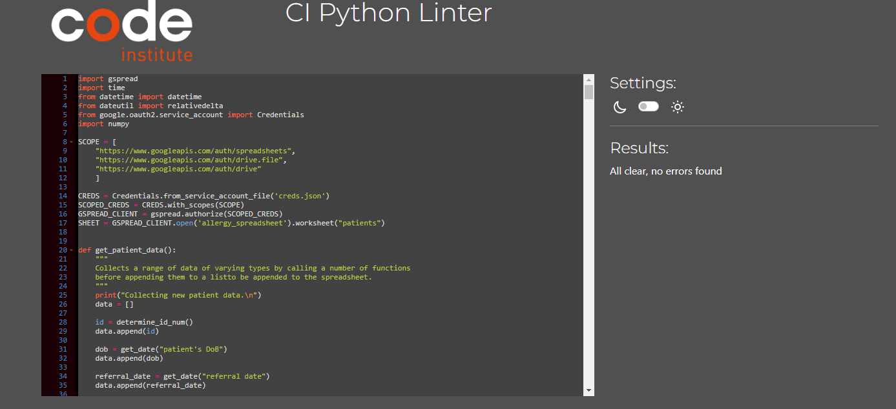

## **Bugs**
### *Calling the main menu twice*
* There was an issue where, if you had performed a number of tasks on this program and then called the close program function, it would return to the main menu. After doing this a number of times, it would, eventually close.
* This bug was caused by forgetting to add 'break' into a while True loop, and so whilst other functions were successfully being called, when they had finished their instructions, the main menu would resume its unfinished loop.
* This issue was resolved by adding 'break' whereever the main() function was called in any and all while True loops.

### *Unresolved bugs*
*No other bugs have been found after going through the entirety of the code.

## **Deployment**

### *Steps for deployment*
* Create a new Heroku app
* Add CREDS file and PORT value: 8000 to the config vars
* Set the buildbacks to NodeJS and Python in that order
* Link Heroku app to this repository
* Click deploy

## **Credits**

### *Code*
* Thanks to Thayif Kabir, Ozgur Vatansever, and Mateen Ulhaq for their explanations on stackoverflow.

### *Project*
* Thanks to Dr Deborah Marriage Ph.D for providing the datasheet used in this program.
* Thanks to Code Institute for providing the Heroku deployment method.
* Thanks to Richard Wells for his ever helpful mentoring.
